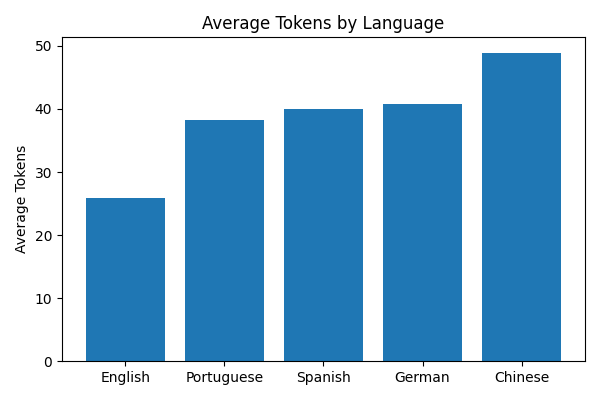
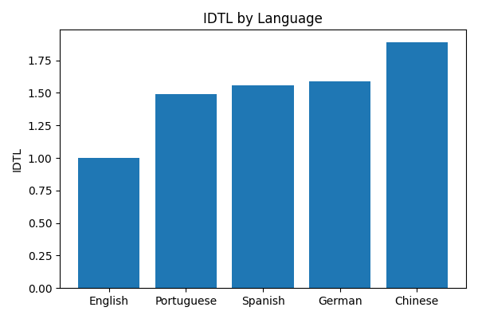
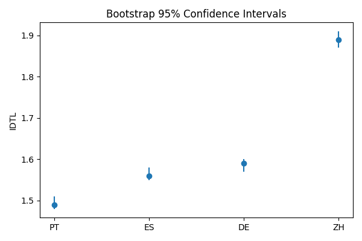

# 🚀 AI, Data Science & Computational Auditing Portfolio

**Mauro Oscar Lua Delboy Céspedes**
Professor & Researcher in Artificial Intelligence and Data Science
Universidad de Monterrey (UDEM)

📧 mauro.delboy@udem.edu

🔗 Google Scholar:
https://scholar.google.com/citations?hl=es&user=dKdW_t8AAAAJ

---

## About Me

Data Scientist, AI Researcher and University Professor with expertise in:

- Machine Learning
- Generative AI
- Causal Machine Learning
- Econometrics
- Computational Linguistics
- Optimization & Prescriptive Analytics

My work focuses on building AI systems, developing analytical frameworks and conducting applied research in artificial intelligence, language models and decision sciences.

---

# Featured Research

## 🏆 Token-Linguistic Inequality in Generative AI

### Computational Auditing Framework for Large Language Models

This research proposes the **Token-Linguistic Inequality Index (IDTL/TLII)**, a novel metric designed to measure computational inequalities across languages in Generative AI systems.

Key Contributions:

- Novel computational auditing framework
- FLORES-200 multilingual benchmark
- 997 parallel observations
- OpenAI cl100k_base tokenizer
- Bootstrap confidence intervals
- Mixed-effects models
- Optimization framework for token efficiency

Main Findings:

| Language | IDTL |
|-----------|------|
| English | 1.00 |
| Portuguese | 1.49 |
| Spanish | 1.56 |
| German | 1.59 |
| Chinese | 1.89 |

Languages may require up to **89% more tokens** to express semantically equivalent information.

📂 Repository:
proyecto_tokenizacion_texto

---

# Projects

## 🤖 Generative AI

### Custom ChatGPT
- LLM implementation
- Conversational AI
- Prompt Engineering

📂 proyecto_chatgpt_propio

---

## 🔥 Predictive Analytics

### Early Wildfire Detection
- Machine Learning
- Classification Models
- Risk Prediction

📂 proyecto_alerta_incendios

---

## 📈 Financial Analytics

### Stock Market Clustering
- Unsupervised Learning
- K-Means
- Market Segmentation

📂 proyecto_clustering

### Stock Prediction
- Time Series
- Forecasting Models
- Financial Data Science

📂 proyecto_prediccion_stocks

---

## 🌐 Data Collection

### Web Scraping Framework
- Python
- BeautifulSoup
- Data Extraction Pipelines

📂 proyecto_web_scraping

---

# Research Interests

- Artificial Intelligence
- Generative AI
- Large Language Models
- Computational Auditing
- Responsible AI
- Machine Learning
- Causal Inference
- Econometrics
- Computational Linguistics

---

# Academic Profiles

Google Scholar:
https://scholar.google.com/citations?hl=es&user=dKdW_t8AAAAJ

LinkedIn:
www.linkedin.com/in/mauro-delboy

GitHub:
https://github.com/MauroDelboyUDEM

---

# Main Results

## Token Efficiency by Language

---

## IDTL by Language

---

## Bootstrap Confidence Intervals

